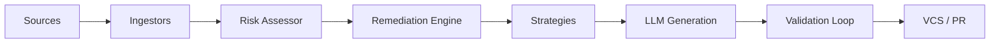

# Autonomous AI Auto-Fixer

The **Autonomous AI Auto-Fixer** is an enterprise-grade agent designed to automate the remediation of technical debt and security vulnerabilities. It integrates with **SonarQube**, **Mend**, and **Trivy** to ingest findings, generate validated code fixes using AI, and submit Pull Requests to **Azure Repos** and **GitHub**.

- [Implementation Plan](IMPLEMENTATION_PLAN.md)
- [Task List](TASKS.md)
- [Configuration & Ingestion Guide](docs/configuration.md)
- [Architecture & Tech Stack](docs/architecture.md)
- [Architecture Diagram (Draw.io)](docs/architecture.drawio)
- [Deployment & Execution Guide](docs/deployment.md)
- [Testing & Verification Guide](docs/testing_guide.md)


## Current Progress
- [x] **Phase 1**: Core Framework & VCS Integration (Azure DevOps, GitHub)
- [x] **Phase 2**: SonarQube Integration (API & File Ingestion)
- [x] **Phase 3**: Mend Integration (SCA, PDF/Excel/CSV)
- [x] **Phase 4**: Trivy Integration (Container & OS Scanning)
- [x] **Phase 5**: Remediation Engine (Linter validation, CI hooks, LLM Retries)
- [x] **Phase 6**: Testing, Deployment & Documentation

## Key Features
- **Autonomous Remediation**: Automatically fixes code smells, bugs, and dependency vulnerabilities using CodeSmell and Dependency strategies.
- **VCS Clients**: Robust integration with Azure DevOps and GitHub for PR management.
- **Risk Assessment**: Classifies findings into Low/High risk to ensure only safe changes are automated.
- **Multi-Tool Ingestion**: Unified ingestion from SonarQube and Mend (vulnerability and technical debt).
- **PR Monitoring**: Human-in-the-loop support via comment polling.
- **Dry-Run Mode**: Supports a "Report Only" mode for human approval before applying any fixes.
- **Enterprise-Grade Security**: Integrated with Azure Key Vault for secure credential management.

## Tech Stack

- **Language**: Python 3.11+
- **Agent Orchestration**: Custom AI reasoning loops
- **Runtime LLM**: GitHub Copilot / Claude Sonnet 4
- **VCS**: Azure DevOps Python SDK, PyGithub
- **Secrets**: Azure Key Vault
- **Infrastructure**: Containerized deployment (Docker/Kubernetes)

## Setup

### Prerequisites

- Python 3.11 or higher
- Access to Azure Key Vault (with appropriate secrets configured)
- VCS Credentials (PAT for Azure DevOps, GitHub App credentials)

### Installation

1. Create a virtual environment:
   ```bash
   python -m venv .venv
   ```

2. Activate the virtual environment:
   - **Windows**: `.venv\Scripts\Activate.ps1`
   - **Linux/macOS**: `source .venv/bin/activate`

3. Install the package in editable mode:
   ```bash
   pip install -e ".[dev]"
   ```

## Usage

Run the autofixer in dry-run mode:
```bash
autofixer --mode dry-run
```

Review the report and approve fixes:
```bash
autofixer --mode fix --approve-all
```

## Audit & Logging


The system maintains a tamper-proof audit log of all actions, including:
- Ingested findings
- Generated prompts and LLM responses
- Validation results
- PR creation details

---

## Architecture Overview

The Autonomous AI Auto-Fixer is built as a modular pipeline:

1. **Ingestion Layer**: Fetches data from SonarQube (Clean Code), Mend (SCA), and Trivy (Container/SCM).
2. **Remediation Engine**: Processes, sorts, and classifies findings based on risk policy.
3. **Strategy Layer**: Selects specific logic (CodeSmell, Dependency, Security) to apply fixes.
4. **AI Orchestration**: Uses GitHub Copilot / Claude 3.5 to generate code and self-correct based on validation feedback.
5. **VCS Layer**: Manages Git operations and Pull Requests on Azure DevOps (Primary) and GitHub.



---

## Configuration & Ingestion

**API-Based Ingestion:**
- Configure SonarQube, Mend, and Trivy API details in `config/default.yaml`.
- Secrets (tokens/keys) are retrieved from Azure Key Vault or environment variables.

**File-Based Ingestion:**
- Pass exported reports (JSON, PDF, Excel, CSV, SARIF) via the CLI `--input-file` flag.
- Place files in `data/inputs/` for automatic scanning.

**Repository Mapping:**
- The agent maps findings to repositories using metadata in reports or CLI flags.

---

## Deployment

**Containerized:**
- Deploy on Azure Container Apps, AKS, or locally with Docker Compose.
- Use the provided `Dockerfile` and `docker-compose.yml`.

**CLI Usage:**
- Run locally after `pip install -e .` or in a container.
- Example:
   ```bash
   autofixer --mode dry-run --repo "my-org/my-repo" --branch "develop"
   autofixer --mode fix --input-file "./manual_reports/mend_vulnerabilities.pdf" --repo "my-org/web-app"
   ```

**PR Workflow:**
- The agent creates PRs in Azure DevOps or GitHub with detailed descriptions and validation evidence.
- Human reviewers can comment on PRs; the agent will attempt to address feedback automatically.

---

## Testing & Verification

**Dry-Run Safety:**
- Run in dry-run mode to preview changes without modifying code.

**Validation:**
- All fixes are validated with linters and optional CI build checks.
- Self-correction loop: If a fix fails validation, the agent retries with improved suggestions.

**PR Comment Interaction:**
- Human-in-the-loop: Reviewer comments on PRs are detected and can trigger automated follow-up commits.

---

## References & Documentation

- [Implementation Plan](IMPLEMENTATION_PLAN.md)
- [Task List](TASKS.md)
- [Configuration & Ingestion Guide](docs/configuration.md)
- [Architecture & Tech Stack](docs/architecture.md)
- [Deployment & Execution Guide](docs/deployment.md)
- [Testing & Verification Guide](docs/testing_guide.md)
