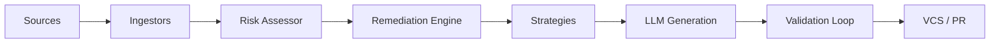

# Architecture & Technology Stack

## System Architecture

The Autonomous AI Auto-Fixer is built as a modular pipeline:

1.  **Ingestion Layer**: Fetches data from SonarQube (Clean Code), Mend (SCA), and Trivy (Container/SCM).
2.  **Remediation Engine**: Processes, sorts, and classifies findings based on risk policy.
3.  **Strategy Layer**: Selects specific logic (CodeSmell, Dependency, Security) to apply fixes.
4.  **AI Orchestration**: Uses GitHub Copilot / Claude 3.5 to generate code and self-correct based on validation feedback.
5.  **VCS Layer**: Manages Git operations and Pull Requests on Azure DevOps (Primary) and GitHub.

## Tech Stack Details

- **Core**: Python 3.11
- **Models**: Pydantic v2
- **APIs**: httpx (async), azure-devops, PyGithub
- **Parsing**: PyMuPDF (PDF), pandas (Excel/CSV)
- **Git**: GitPython
- **LLM**: Claude 3.5 Sonnet / GPT-4o
- **Security**: Azure Key Vault
- **Logging**: structlog with tamper-proof hashing
